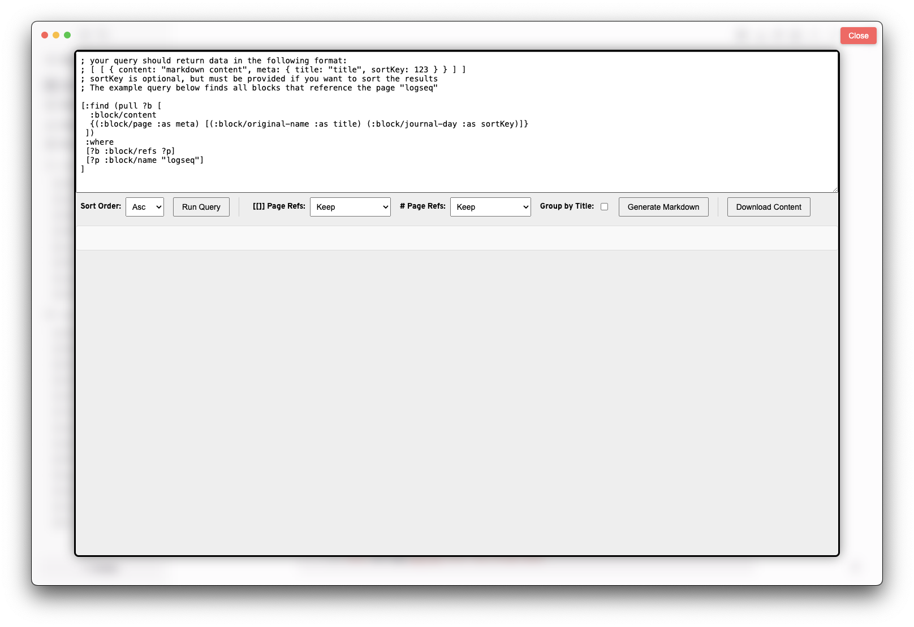

# Logseq Query Exporter Plugin

A plugin for Logseq that allows you to run a query and export the results to markdown.



You can run any query you'd like. If you'd like to take advantage of sorting or exporting to markdown, the results of your query will need to produce data with the following structure:

```json
[ 
    [ 
        { 
            content: "markdown content", 
            meta: 
            { 
                title: "title", 
                sortKey: 123 
            } 
        } 
    ] 
]
```

When you first open the plugin, the same query will provide results in the expected format. For reference, that query is:

```cljs
[:find (pull ?b [
  :block/content
  {(:block/page :as meta) [(:block/original-name :as title) (:block/journal-day :as sortKey)]}
 ])
 :where
 [?b :block/refs ?p]
 [?p :block/name "logseq"]
]
```

